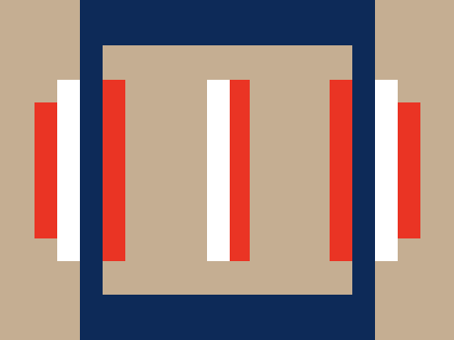

# #265. Barcode

Challenge: <https://cssbattle.dev/play/265>

## Result

<table>
	<tr>
		<th width="50%">User Submission</th>
		<th width="50%">Target</th>
	</tr>
	<tr>
		<td width="50%" align="center">
			
		</td>
		<td width="50%" align="center">
			
		</td>
	</tr>
</table>

## Code

```html
<p a><p b><p b c><style>*{background:#C5AE92}[a]{width:220;height:220;border:solid#0D2A58;border-width:40 20;margin:-8 62}[b]{width:20;height:120;background:#EA3424;margin:-210 22;box-shadow:80vw 0#EA3424}[c]{height:160;margin:70 82;box-shadow:-5ch 0#fff,5lh 0#fff,116q 0#EA3424,50vw 0#EA3424,60vw 0#fff
```
