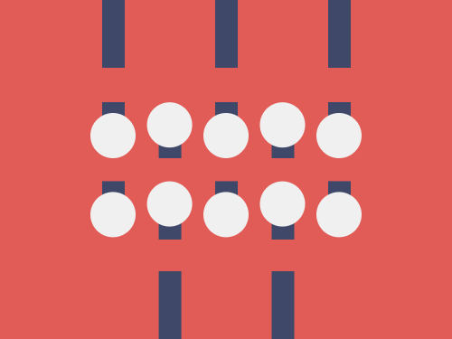

# #267. Knobs

Challenge: <https://cssbattle.dev/play/267>

## Result

<table>
	<tr>
		<th width="50%">User Submission</th>
		<th width="50%">Target</th>
	</tr>
	<tr>
		<td width="50%" align="center">
			
		</td>
		<td width="50%" align="center">
			
		</td>
	</tr>
</table>

## Code

```html
<p><p a><p b><style>*{background:#E25C57}p{width:20;height:60;background:#3F4869;color:#3F4869;margin:-8 82;box-shadow:25vw 0,50vw 0,53q 60vw,50vh 60vw}[a]{height:30;margin:38 82;box-shadow:53q 5vw,25vw 0,50vh 5vw,50vw 0,0 74q,53q 5lh,25vw 74q,50vh 5lh,50vw 74q}[b]{width:40;height:40;border-radius:50%;background:#F0F0F0;color:#F0F0F0;margin:-58 72;box-shadow:53q -10q,25vw 0,50vh -10q,50vw 0,0 74q,53q 64q,25vw 74q,50vh 64q,50vw 74q
```
