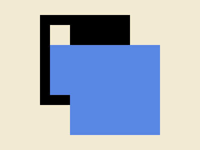

# #268. Square Shift

Challenge: <https://cssbattle.dev/play/268>

## Result

<table>
	<tr>
		<th width="50%">User Submission</th>
		<th width="50%">Target</th>
	</tr>
	<tr>
		<td width="50%" align="center">
			
		</td>
		<td width="50%" align="center">
			
		</td>
	</tr>
</table>

## Code

```html
<p a><p><style>*{background:#F3EAD2}[a]{width:180;height:180;background:#5887E4;margin:90 132;box-shadow:-63q -63q#000}p{width:40;height:140;margin:-310 92;background:linear-gradient(#F3EAD2 0 28.5%,#5887E4 28.5%
```
