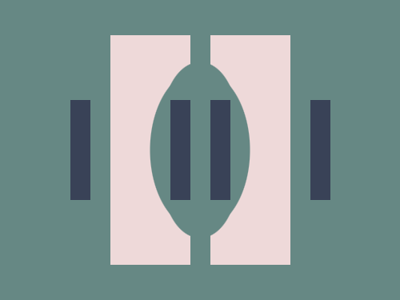
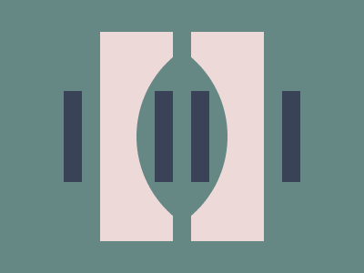

# #269. Parentheses

Challenge: <https://cssbattle.dev/play/269>

## Result

<table>
	<tr>
		<th width="50%">User Submission</th>
		<th width="50%">Target</th>
	</tr>
	<tr>
		<td width="50%" align="center">
			
		</td>
		<td width="50%" align="center">
			
		</td>
	</tr>
</table>

## Code

```html
<p a><p b><p b c><p b c d><p e><style>*{background:#668884}[a]{width:180;height:230;background:#EED9D9;margin:35 102}[b]{width:200;height:200;clip-path:ellipse(25%40%);margin:-250 92}[c]{width:150;height:150;margin:47 117}[d]{margin:-141 117}[e]{position:fixed;width:20;height:100;background:#394257;color:#394257;margin:-12 62;box-shadow:30vw -7lh#668884,30vw 70q#668884,25vw 0,35vw 0,60vw 0
```
