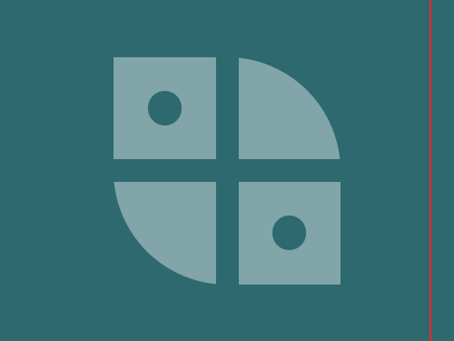

# Daily Target — Jun 15, 2026

Challenge: <https://cssbattle.dev/play/huzTWsbhbRLHx1qJWmnm>

## Result

<table>
	<tr>
		<th width="50%">User Submission</th>
		<th width="50%">Target</th>
	</tr>
	<tr>
		<td width="50%" align="center">
			
		</td>
		<td width="50%" align="center">
			
		</td>
	</tr>
</table>

## Code

```html
<p><p a><p a b><p c><style>*,[c]{background:#2D696F}p{width:200;height:200;border-radius:50%;background:#81A5A9;margin:50 92}[a]{width:90;height:90;border:5vw solid#2D696F;margin:-270 72;border-radius:0}[b]{margin:250 182}[c]{width:30;height:30;margin:-440 122;box-shadow:116q 116q#2D696F
```
