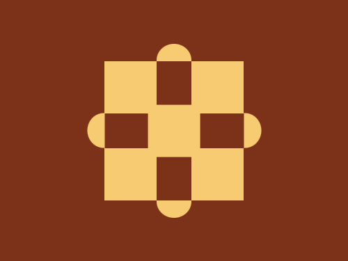

# Daily Target — Jun 16, 2026

Challenge: <https://cssbattle.dev/play/XmvF6SFxJCXoh15eyrGD>

## Result

<table>
	<tr>
		<th width="50%">User Submission</th>
		<th width="50%">Target</th>
	</tr>
	<tr>
		<td width="50%" align="center">
			
		</td>
		<td width="50%" align="center">
			
		</td>
	</tr>
</table>

## Code

```html
<p a><p b><p b c><style>*{background:#7C3219}p{background:#F7CB71}[a]{width:60;height:60;color:#F7CB71;margin:70 112;box-shadow:25vw 0,0 25vw,25vw 25vw,53q 53q}[b]{width:40;height:20;border-radius:5vw 5vw 0 0;margin:-150 172;-webkit-box-reflect:below 40vw}[c]{margin:220 82;transform:rotate(-90deg
```
