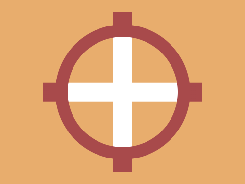
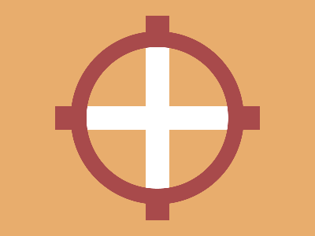

# Daily Target — Jun 17, 2026

Challenge: <https://cssbattle.dev/play/gWRvIYqOilEJ5qzQONIM>

## Result

<table>
	<tr>
		<th width="50%">User Submission</th>
		<th width="50%">Target</th>
	</tr>
	<tr>
		<td width="50%" align="center">
			
		</td>
		<td width="50%" align="center">
			
		</td>
	</tr>
</table>

## Code

```html
<p><p a><p b><style>*{position:fixed;background:#E8AD6D}p{width:30;height:260;margin:12 177;background:linear-gradient(#A84A4B 0 32q,#fff 32q 55vw,#A84A4B 0)}[b]{width:180;height:180;background:#0000;border:5vw solid#A84A4B;border-radius:50%;margin:32 82}[a]{transform:rotate(90deg
```
