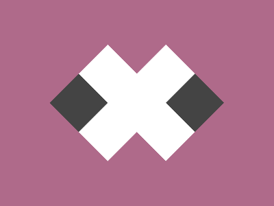

# Daily Target — Jun 19, 2026

Challenge: <https://cssbattle.dev/play/5HntWfntp6RmDVX4hhHs>

## Result

<table>
	<tr>
		<th width="50%">User Submission</th>
		<th width="50%">Target</th>
	</tr>
	<tr>
		<td width="50%" align="center">
			
		</td>
		<td width="50%" align="center">
			
		</td>
	</tr>
</table>

## Code

```html
<p><p a>
<style>
  *{
    margin:0;
    position:fixed;
    background:#AF6A8A;
  }
  p{
    width:60;
    height:60;
    background:#444;
    border:solid#fff;
    border-width:60 60 0 0;
    transform:rotate(45deg);
    margin:90 98;
  }
  [a]{
    transform:rotate(-135deg);
    margin:90 183;
  }
</style>
```
