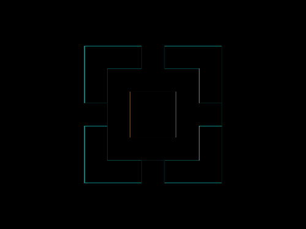

# Daily Target — Jun 21, 2026

Challenge: <https://cssbattle.dev/play/YJ5FEvmSn4jjeldoB66K>

## Result

<table>
	<tr>
		<th width="50%">User Submission</th>
		<th width="50%">Target</th>
	</tr>
	<tr>
		<td width="50%" align="center">
			
		</td>
		<td width="50%" align="center">
			
		</td>
	</tr>
</table>

## Code

```html
<p><p a>
<style>
  p{
    width:60;
    height:60;
    background:#004B8E;
    margin:120 162;
    box-shadow:0 0 0 32q#fff,0 0 0 63q#EC1D25;
  }
  [a]{
    width:30;
    height:30;
    background:#fff;
    color:#fff;
    margin:-240 177;
    box-shadow:-75px 75px,75px 75px,0 50vh;
  }
</style>
```
