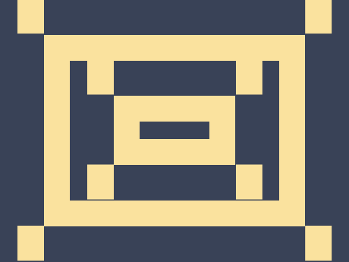

# Daily Target — Jun 24, 2026

Challenge: <https://cssbattle.dev/play/Dk54uDFqfQ9QnaYGzSTO>

## Result

<table>
	<tr>
		<th width="50%">User Submission</th>
		<th width="50%">Target</th>
	</tr>
	<tr>
		<td width="50%" align="center">
			
		</td>
		<td width="50%" align="center">
			
		</td>
	</tr>
</table>

## Code

```html
<p a><p a b><p c><style>*{background:#394257}[a]{width:240;height:160;border:32q solid#FAE29E;margin:40 42}[b]{width:80;height:20;margin:-190 122}[c]{width:30;height:40;background:#FAE29E;color:#FAE29E;margin:0 12;box-shadow:349q 0,0 65vw,349q 65vw,5pc 74q,265q 74q,5pc 190px,265q 190px
```
