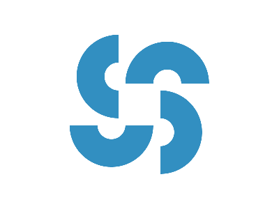

# Daily Target — Jun 25, 2026

Challenge: <https://cssbattle.dev/play/vsqDKNu2ZyCHhsIFFDnD>

## Result

<table>
	<tr>
		<th width="50%">User Submission</th>
		<th width="50%">Target</th>
	</tr>
	<tr>
		<td width="50%" align="center">
			
		</td>
		<td width="50%" align="center">
			
		</td>
	</tr>
</table>

## Code

```html
<p><p a><p b><p c><style>p{width:40;height:20;border:solid#328FC1;border-width:40 40 0;margin:60 172;border-radius:5pc 5pc 0 0}[a]{rotate:90deg;margin:-20 192}[b]{rotate:-90deg;margin:-140 72}[c]{rotate:180deg;margin:180 92
```
