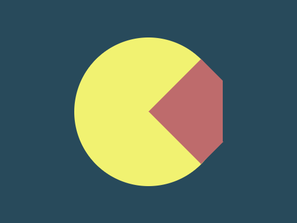

# Daily Target — Jun 28, 2026

Challenge: <https://cssbattle.dev/play/zhqVcCGcq24I4ItesJgY>

## Result

<table>
	<tr>
		<th width="50%">User Submission</th>
		<th width="50%">Target</th>
	</tr>
	<tr>
		<td width="50%" align="center">
			
		</td>
		<td width="50%" align="center">
			
		</td>
	</tr>
</table>

## Code

```html
<p a><p b><p><style>*{position:fixed;background:#284A5B}[a]{width:200;height:200;border-radius:50%;background:#F1F271;margin:42 92}[b]{width:100;height:100;background:#BE6B6C;rotate:45deg;margin:92 213}p{width:50;height:90;margin:92 292
```
