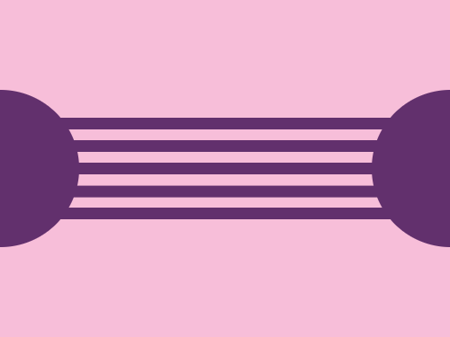
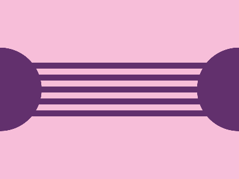

# Daily Target — Jun 30, 2026

Challenge: <https://cssbattle.dev/play/3bZZVPZQWMXqq8yg75W5>

## Result

<table>
	<tr>
		<th width="50%">User Submission</th>
		<th width="50%">Target</th>
	</tr>
	<tr>
		<td width="50%" align="center">
			
		</td>
		<td width="50%" align="center">
			
		</td>
	</tr>
</table>

## Code

```html
<p><p a><style>*{background:#F7BED9}p{width:300;height:10;background:#62306D;color:#62306D;margin:105 42;box-shadow:0 5vw,0 5ch,0 64q,0 5pc}[a]{width:140;height:140;border-radius:50%;margin:-140-78;box-shadow:25pc 0
```
