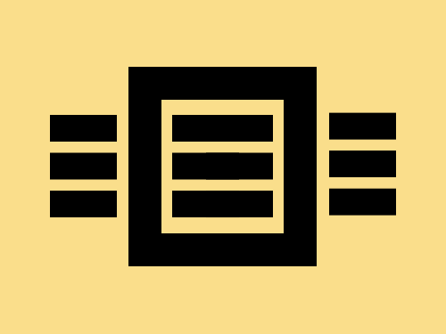

# Daily Target — Jul 2, 2026

Challenge: <https://cssbattle.dev/play/nXGWhRanLkXsKymyC5xU>

## Result

<table>
	<tr>
		<th width="50%">User Submission</th>
		<th width="50%">Target</th>
	</tr>
	<tr>
		<td width="50%" align="center">
			
		</td>
		<td width="50%" align="center">
			
		</td>
	</tr>
</table>

## Code

```html
<p a><p b><style>*{background:#FADE8B}[a]{width:110;height:120;border:32q solid;margin:60 107}[b]{width:60;height:24;background:#000;margin:-196 37;box-shadow:116q 0,35vw 0,265q -2q,0 36q,116q 36q,35vw 36q,265q 8vw,0 72q,116q 72q,35vw 72q,265q 70q
```
