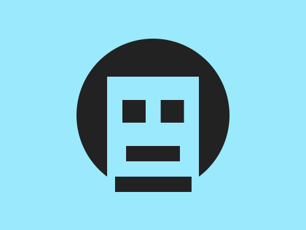

# Daily Target — Jul 3, 2026

Challenge: <https://cssbattle.dev/play/bzQ591FAfiRjAtqMae1E>

## Result

<table>
	<tr>
		<th width="50%">User Submission</th>
		<th width="50%">Target</th>
	</tr>
	<tr>
		<td width="50%" align="center">
			
		</td>
		<td width="50%" align="center">
			
		</td>
	</tr>
</table>

## Code

```html
<p a><p b><p c><p d><p d e><style>*,[b]{background:#9BE9FD}p{background:#222}[a]{width:200;height:200;border-radius:50%;margin:50 92}[b]{width:120;height:150;margin:-200 132}[c]{width:30;height:30;margin:80 152;box-shadow:53q 0#222}[d]{width:70;height:20;margin:-50 157}[e]{width:100;margin:70 142
```
