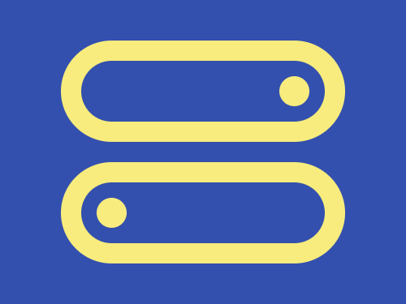

# Daily Target — Jul 5, 2026

Challenge: <https://cssbattle.dev/play/B85IWOvFPcgdhZglP3Zt>

## Result

<table>
	<tr>
		<th width="50%">User Submission</th>
		<th width="50%">Target</th>
	</tr>
	<tr>
		<td width="50%" align="center">
			
		</td>
		<td width="50%" align="center">
			
		</td>
	</tr>
</table>

## Code

```html
<p a><p b><style>*{background:#3450AE}[a]{width:30;height:30;border-radius:50%;background:#F7EC7D;margin:75 267;box-shadow:-45vw 30vw#F7EC7D}[b]{width:240;height:60;background:#0000;border:5vw solid#F7EC7D;border-radius:5pc;margin:-140 52;-webkit-box-reflect:below 5vw
```
