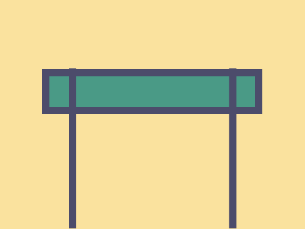

# Daily Target — Jul 8, 2026

Challenge: <https://cssbattle.dev/play/3XH4lVrpfDgTcrxgYXt5>

## Result

<table>
	<tr>
		<th width="50%">User Submission</th>
		<th width="50%">Target</th>
	</tr>
	<tr>
		<td width="50%" align="center">
			
		</td>
		<td width="50%" align="center">
			
		</td>
	</tr>
</table>

## Code

```html
<p a><p b><style>*{background:#FAE29E}[a]{width:270;height:40;background:#4A9A86;border:11q solid#4C4C6B;margin:90 47}[b]{width:10;height:210;background:#4C4C6B;margin:-150 82;box-shadow:70vh 0#4C4C6B
```
