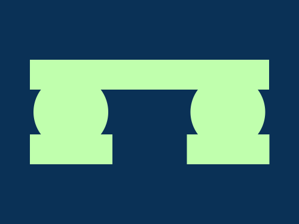

# Daily Target — Jul 9, 2026

Challenge: <https://cssbattle.dev/play/h3l8ESz0rxoqQDKXESq7>

## Result

<table>
	<tr>
		<th width="50%">User Submission</th>
		<th width="50%">Target</th>
	</tr>
	<tr>
		<td width="50%" align="center">
			
		</td>
		<td width="50%" align="center">
			
		</td>
	</tr>
</table>

## Code

```html
<p><p a><p a b><style>*{background:#0A3156}p{width:320;height:40;background:#C0FFAD;margin:80 32}[a]{width:110;margin:-20 32;box-shadow:70vh 0#C0FFAD}[b]{width:100;height:100;border-radius:50%;margin:-120 37
```
