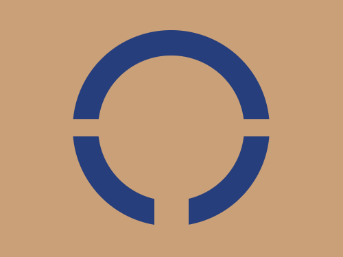
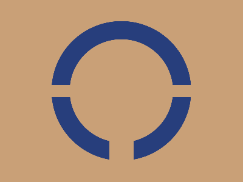

# Daily Target — Jul 10, 2026

Challenge: <https://cssbattle.dev/play/roAyjEeXtmG1qITOSiXY>

## Result

<table>
	<tr>
		<th width="50%">User Submission</th>
		<th width="50%">Target</th>
	</tr>
	<tr>
		<td width="50%" align="center">
			
		</td>
		<td width="50%" align="center">
			
		</td>
	</tr>
</table>

## Code

```html
<p a><p b><p><style>*{background:#C9A077}[a]{width:170;height:170;border-radius:50%;border:32q solid#273E7C;margin:35 77}[b]{width:230;height:20;margin:-160 77}p{width:40;height:40;margin:230 172
```
