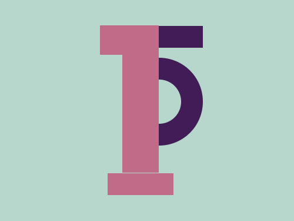

# Daily Target — Jul 12, 2026

Challenge: <https://cssbattle.dev/play/80Er6Y1RveWdX3PjVkl0>

## Result

<table>
	<tr>
		<th width="50%">User Submission</th>
		<th width="50%">Target</th>
	</tr>
	<tr>
		<td width="50%" align="center">
			
		</td>
		<td width="50%" align="center">
			
		</td>
	</tr>
</table>

## Code

```html
<p a><p b><p c><p c d><style>*{background:#B7D7CD}[a]{width:90;height:30;background:#411C56;margin:35 178;box-shadow:-5ch 50vw#C06C88}[b]{width:30;height:60;border-radius:0 63q 63q 0;border:solid#411C56;border-width:30 30 30 0;margin:-22 208}[c]{width:80;height:40;background:#C06C88;margin:-163 128}[d]{width:50;height:160;margin:163 158
```
