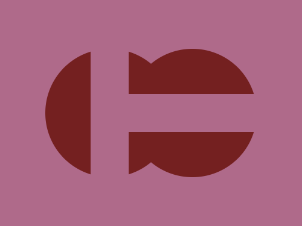

# Daily Target — Jul 16, 2026

Challenge: <https://cssbattle.dev/play/ZHdqz6FmXWrev0SARB8I>

## Result

<table>
	<tr>
		<th width="50%">User Submission</th>
		<th width="50%">Target</th>
	</tr>
	<tr>
		<td width="50%" align="center">
			
		</td>
		<td width="50%" align="center">
			
		</td>
	</tr>
</table>

## Code

```html
<p a><p><p b><style>*{background:#AF6A8A}[a]{width:170;height:170;border-radius:50%;background:#742020;margin:65 52;box-shadow:116q 0#742020}p{width:50;height:170;margin:-235 112}[b]{rotate:90deg;margin:65 222
```
