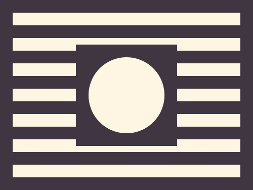

# Daily Target — Jul 23, 2026

Challenge: <https://cssbattle.dev/play/859niQYa0JbjMbzMNadA>

## Result

<table>
	<tr>
		<th width="50%">User Submission</th>
		<th width="50%">Target</th>
	</tr>
	<tr>
		<td width="50%" align="center">
			
		</td>
		<td width="50%" align="center">
			
		</td>
	</tr>
</table>

## Code

```html
<p a><p><p b><style>*{background:#3F3642}p{width:160;height:160;margin:-230 112}[b]{width:120;height:120;background:#FEF6E2;border-radius:50%;margin:90 132}[a]{width:360;height:260;margin:20 12;background:repeating-linear-gradient(#FEF6E2 0 5vw,#3F3642 5vw 5ch
```
