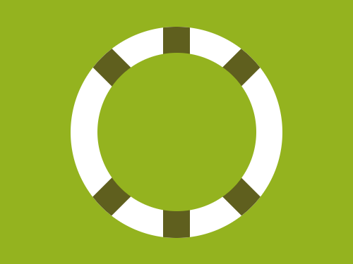

# Daily Target — Jul 25, 2026

Challenge: <https://cssbattle.dev/play/sbyqdHz6FqGxo0iTfaxX>

## Result

<table>
	<tr>
		<th width="50%">User Submission</th>
		<th width="50%">Target</th>
	</tr>
	<tr>
		<td width="50%" align="center">
			
		</td>
		<td width="50%" align="center">
			
		</td>
	</tr>
</table>

## Code

```html
<div><p><p a><p b><p c><style>*,[c]{margin:0;background:#94B31F}div,[c]{border-radius:50%}div{width:240;height:240;background:#fff;margin:30 80;overflow:hidden}p{width:30;height:260;background:#5F5F1E;margin:-10 105}[a]{rotate:45deg;margin:-260 105}[b]{rotate:-45deg}[c]{position:fixed;width:180;height:180;margin:-210 30
```
