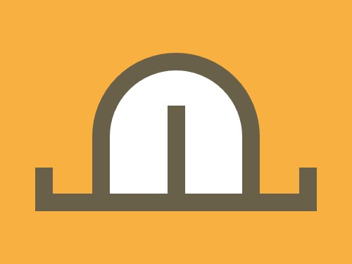

# Daily Target — Jul 30, 2026

Challenge: <https://cssbattle.dev/play/kmnEBhr0xnz7J8MSeSpa>

## Result

<table>
	<tr>
		<th width="50%">User Submission</th>
		<th width="50%">Target</th>
	</tr>
	<tr>
		<td width="50%" align="center">
			
		</td>
		<td width="50%" align="center">
			
		</td>
	</tr>
</table>

## Code

```html
<p a><p b><p c><style>*{background:#F8B140}[a]{width:280;height:30;border:solid#696049;border-width:0 20 20;margin:190 32}[b]{width:150;height:140;background:#fff;border:5vw solid#696049;margin:-370 97;border-radius:30vw 30vw 0 0}[c]{width:20;height:100;background:#696049;margin:250 182
```
