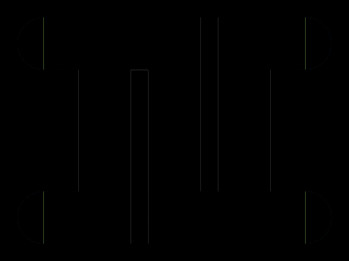

# Daily Target — Jul 31, 2026

Challenge: <https://cssbattle.dev/play/Fyddj98G3Aus7byaOz8c>

## Result

<table>
	<tr>
		<th width="50%">User Submission</th>
		<th width="50%">Target</th>
	</tr>
	<tr>
		<td width="50%" align="center">
			
		</td>
		<td width="50%" align="center">
			
		</td>
	</tr>
</table>

## Code

```html
<p a><p b><p c><style>*{position:fixed;background:#6592CF}[b]{width:220;height:140;background:#A8D38B;margin:72 82}[c]{width:20;height:200;margin:12 222;box-shadow:-5pc 64q#6592CF}[a]{width:360;height:60;margin:12;border-radius:5ch;-webkit-box-reflect:below 35vw;background:linear-gradient(to right,#3F3642 0 32q,#A8D38B 32q 349q,#3F3642 0
```
