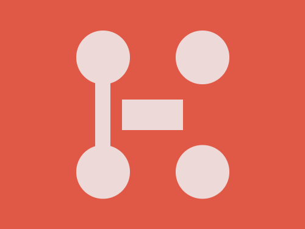

# Daily Target — Aug 2, 2026

Challenge: <https://cssbattle.dev/play/j5lNXe0bnIf95N6TxmQ7>

## Result

<table>
	<tr>
		<th width="50%">User Submission</th>
		<th width="50%">Target</th>
	</tr>
	<tr>
		<td width="50%" align="center">
			
		</td>
		<td width="50%" align="center">
			
		</td>
	</tr>
</table>

## Code

```html
<p><p a><p b><style>*{background:#E05947}p{width:80;height:40;background:#EED9D9;color:#EED9D9;margin:130 152}[a]{width:20;height:90;margin:-195 117}[b]{width:70;height:70;border-radius:50%;margin:40 92;box-shadow:138q 0,0 50vh,138q 50vh
```
