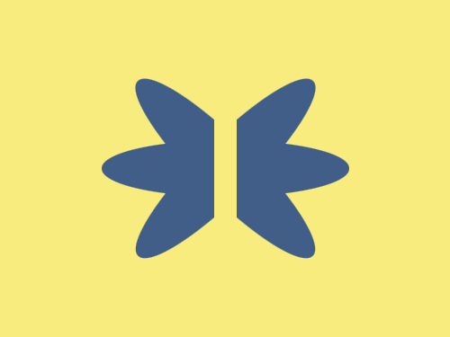

# Daily Target — Aug 3, 2026

Challenge: <https://cssbattle.dev/play/K5tl2pHRpNXPbByrJmVW>

## Result

<table>
	<tr>
		<th width="50%">User Submission</th>
		<th width="50%">Target</th>
	</tr>
	<tr>
		<td width="50%" align="center">
			
		</td>
		<td width="50%" align="center">
			
		</td>
	</tr>
</table>

## Code

```html
<p a><p a b><p a c><p><style>*{position:fixed;background:#F7EC7D}[a]{width:220;height:50;background:#415E88;margin:117 82;border-radius:50%}[b]{rotate:-45deg}[c]{rotate:45deg}p{width:20;height:120;margin:82 182
```
