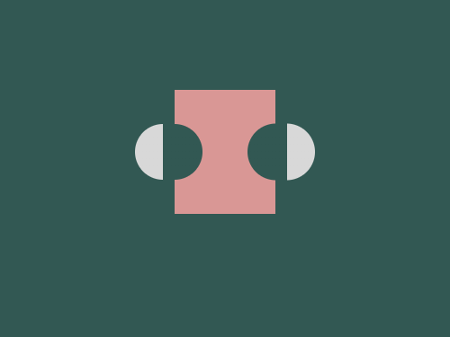

# Daily Target — Aug 4, 2026

Challenge: <https://cssbattle.dev/play/qfoEI6akJpQgni9f79Wa>

## Result

<table>
	<tr>
		<th width="50%">User Submission</th>
		<th width="50%">Target</th>
	</tr>
	<tr>
		<td width="50%" align="center">
			
		</td>
		<td width="50%" align="center">
			
		</td>
	</tr>
</table>

## Code

```html
<p><p a><p a b><style>*{background:#325853}p{width:90;height:110;background:#D99795;margin:80 147}[a]{width:60;height:50;margin:-160 112;border-radius:5ch;background:linear-gradient(to right,#D8D8D8 0 25px,#325853 25px 0)}[b]{rotate:180deg;margin:110 212
```
