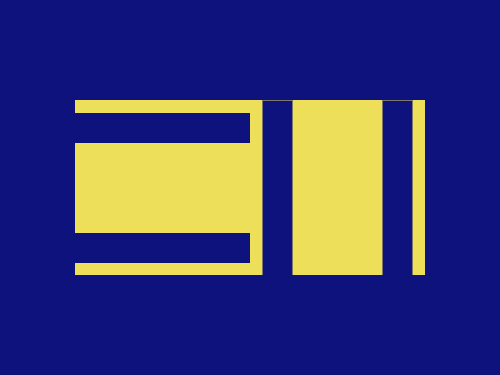
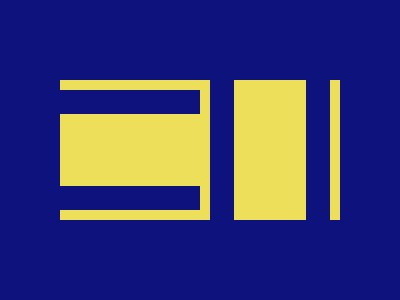

# Daily Target — Aug 6, 2026

Challenge: <https://cssbattle.dev/play/pSfUqdmXCS6D0TBIPxii>

## Result

<table>
	<tr>
		<th width="50%">User Submission</th>
		<th width="50%">Target</th>
	</tr>
	<tr>
		<td width="50%" align="center">
			
		</td>
		<td width="50%" align="center">
			
		</td>
	</tr>
</table>

## Code

```html
<p a><p b><p b c><style>*{background:#0E127D}[a]{width:280;height:140;margin:80 52;background:#EDDF5A}[b]{width:140;height:24;margin:-210 52;box-shadow:0 1in#0E127D}[c]{rotate:90deg;margin:234 240
```
