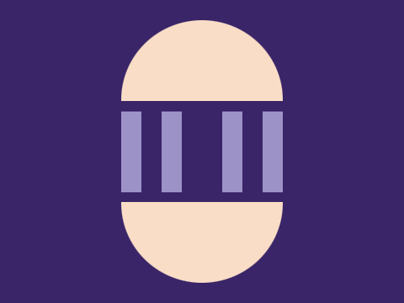

# Daily Target — Aug 11, 2026

Challenge: <https://cssbattle.dev/play/9PFKqCOsKmSizurb6gRt>

## Result

<table>
	<tr>
		<th width="50%">User Submission</th>
		<th width="50%">Target</th>
	</tr>
	<tr>
		<td width="50%" align="center">
			
		</td>
		<td width="50%" align="center">
			
		</td>
	</tr>
</table>

## Code

```html
<p a><p b><style>*{background:#3A2568}[a]{width:160;height:80;margin:20 112;background:#F9DDC6;border-radius:5pc 5pc 0 0;-webkit-box-reflect:below 25vw}[b]{width:20;height:80;background:#9D92C8;color:#9D92C8;margin:-10 112;box-shadow:5ch 0,25vw 0,35vw 0
```
