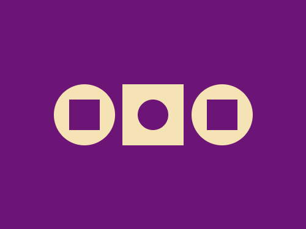
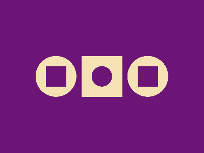

# Daily Target — Aug 14, 2026

Challenge: <https://cssbattle.dev/play/tX0iC11qNcPozRZ9qhRO>

## Result

<table>
	<tr>
		<th width="50%">User Submission</th>
		<th width="50%">Target</th>
	</tr>
	<tr>
		<td width="50%" align="center">
			
		</td>
		<td width="50%" align="center">
			
		</td>
	</tr>
</table>

## Code

```html
<p a><p a b><p c><p d><style>*{background:#6D1477}[b],[d]{border-radius:50%}[a]{width:80;height:80;background:#F5E3B5;margin:110 152}[b]{margin:-190 62;box-shadow:45vw 0#F5E3B5}[c],[d]{width:40;height:40}[c]{margin:130 82;box-shadow:45vw 0#6D1477}[d]{margin:-170 172
```
