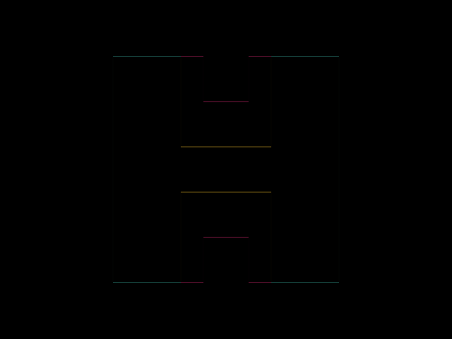

# Daily Target — Aug 18, 2026

Challenge: <https://cssbattle.dev/play/OqjzeCZTtlVTfqqvKCRg>

## Result

<table>
	<tr>
		<th width="50%">User Submission</th>
		<th width="50%">Target</th>
	</tr>
	<tr>
		<td width="50%" align="center">
			
		</td>
		<td width="50%" align="center">
			
		</td>
	</tr>
</table>

## Code

```html
<p><p a><p b><style>*{position:fixed;background:#51A499}p{width:60;height:200;background:#282828;border:solid#EAC049;border-width:0 20 0 0;margin:42 92}[a]{rotate:180deg;margin:42 212}[b]{width:80;height:40;border-width:40 0;margin:82 152
```
