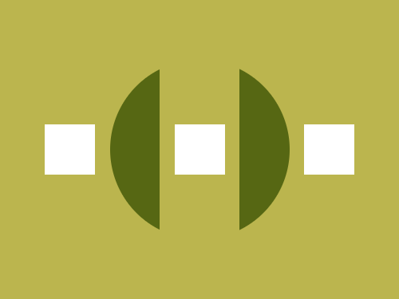

# Daily Target — Aug 26, 2026

Challenge: <https://cssbattle.dev/play/73FtfyFQ7BgJHeS18cU0>

## Result

<table>
	<tr>
		<th width="50%">User Submission</th>
		<th width="50%">Target</th>
	</tr>
	<tr>
		<td width="50%" align="center">
			
		</td>
		<td width="50%" align="center">
			
		</td>
	</tr>
</table>

## Code

```html
<p a><p><p b><style>*{background:#BBB54E}[a]{width:180;height:180;border-radius:50%;background:#566713;margin:60 102}p{width:80;height:190;margin:-245 152}[b]{width:50;height:50;background:#fff;margin:125 37;box-shadow:138q 0#fff,65vw 0#fff
```
