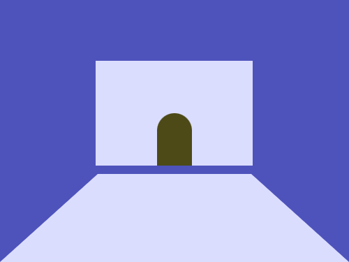
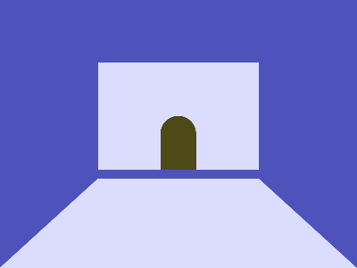

# Daily Target — Aug 27, 2026

Challenge: <https://cssbattle.dev/play/s17MKgzJQsAf1vObf9Ta>

## Result

<table>
	<tr>
		<th width="50%">User Submission</th>
		<th width="50%">Target</th>
	</tr>
	<tr>
		<td width="50%" align="center">
			
		</td>
		<td width="50%" align="center">
			
		</td>
	</tr>
</table>

## Code

```html
<p a><p b><p c><style>*{background:#4E53BB}[a]{border-left:50vw solid#0000;border-right:50vw solid#0000;border-bottom:45vw solid#DBDDFF;margin:120-8}[b]{width:180;height:120;background:#DBDDFF;border:11q solid#4E53BB;margin:-360 92}[c]{width:40;height:60;background:#4D4A18;margin:290 172;border-radius:5vw 5vw 0 0
```
