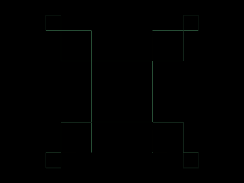
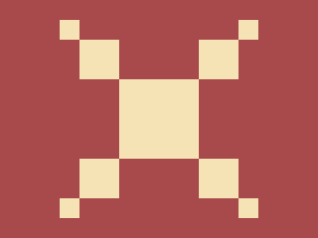

# Daily Target — Sep 2, 2026

Challenge: <https://cssbattle.dev/play/AJ9pZiNcFlllq1qpGyeW>

## Result

<table>
	<tr>
		<th width="50%">User Submission</th>
		<th width="50%">Target</th>
	</tr>
	<tr>
		<td width="50%" align="center">
			
		</td>
		<td width="50%" align="center">
			
		</td>
	</tr>
</table>

## Code

```html
<p><p a><p b><style>*{background:#A84A4B}p{width:100;height:100;background:#F5E3B5;color:#F5E3B5;margin:100 142}[a]{width:50;height:50;margin:-250 92;box-shadow:50vh 0,0 50vh,50vh 50vh}[b]{width:25;height:25;margin:175 67;box-shadow:75vh 0,0 75vh,75vh 75vh
```
