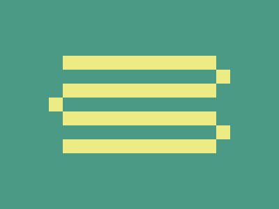

# Daily Target — Sep 4, 2026

Challenge: <https://cssbattle.dev/play/IIybN3XMPLYHSO3ij2ge>

## Result

<table>
	<tr>
		<th width="50%">User Submission</th>
		<th width="50%">Target</th>
	</tr>
	<tr>
		<td width="50%" align="center">
			
		</td>
		<td width="50%" align="center">
			
		</td>
	</tr>
</table>

## Code

```html
<p><p a><style>*{background:#4A9A86}p{width:220;height:20;background:#EDEC84;color:#EDEC84;margin:80 82;box-shadow:0 5ch,0 5pc,0 30vw}[a]{width:20;margin:-80 302;box-shadow:-60vw 5ch,0 5pc
```
