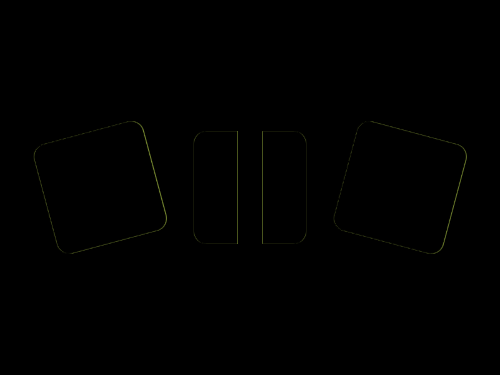

# Daily Target — Sep 6, 2026

Challenge: <https://cssbattle.dev/play/WfbQAGPzXCTFkJjKBxhZ>

## Result

<table>
	<tr>
		<th width="50%">User Submission</th>
		<th width="50%">Target</th>
	</tr>
	<tr>
		<td width="50%" align="center">
			
		</td>
		<td width="50%" align="center">
			
		</td>
	</tr>
</table>

## Code

```html
<p><p a><p b><p c><style>p{width:90;height:90;background:#6D57C4;margin:105 147;border-radius:11q}[a]{rotate:15deg;margin:-195 267}[b]{rotate:-15deg;margin:105 27}[c]{background:#fff;width:20;height:110;margin:-205 182
```
