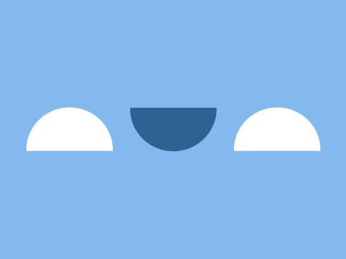

# Daily Target — Sep 7, 2026

Challenge: <https://cssbattle.dev/play/VxH9v8gyndTt19Z4EkeY>

## Result

<table>
	<tr>
		<th width="50%">User Submission</th>
		<th width="50%">Target</th>
	</tr>
	<tr>
		<td width="50%" align="center">
			
		</td>
		<td width="50%" align="center">
			
		</td>
	</tr>
</table>

## Code

```html
<p><p a><style>*{background:#84B9EF}p{width:100;height:50;border-radius:0 0 53q 53q;background:#2F6193;margin:125 142}[a]{rotate:180deg;background:#fff;margin:-175 22;box-shadow:-60vw 0#fff
```
