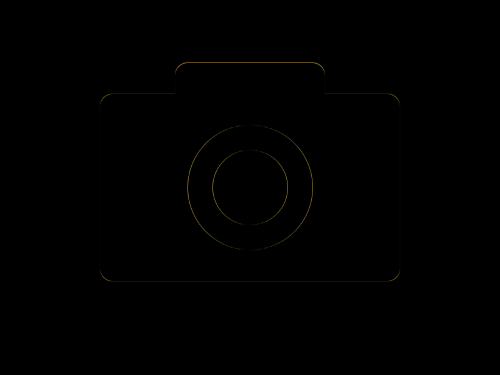

# Daily Target — Sep 8, 2026

Challenge: <https://cssbattle.dev/play/YaO5dVF3I9R870zMutcX>

## Result

<table>
	<tr>
		<th width="50%">User Submission</th>
		<th width="50%">Target</th>
	</tr>
	<tr>
		<td width="50%" align="center">
			
		</td>
		<td width="50%" align="center">
			
		</td>
	</tr>
</table>

## Code

```html
<p><p a><p b><style>*{background:#F1D36F}p{width:240;height:150;background:#333;margin:75 72;border-radius:11q}[a]{width:120;margin:-250 132}[b]{width:60;height:60;border-radius:50%;border:5vw solid#F1D36F;margin:150 142
```
