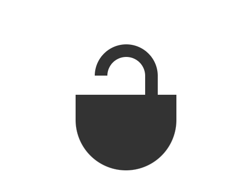

# Daily Target — Sep 10, 2026

Challenge: <https://cssbattle.dev/play/YdSTFgl2iKzGCW1ahmEz>

## Result

<table>
	<tr>
		<th width="50%">User Submission</th>
		<th width="50%">Target</th>
	</tr>
	<tr>
		<td width="50%" align="center">
			
		</td>
		<td width="50%" align="center">
			
		</td>
	</tr>
</table>

## Code

```html
<p a><p b><p><style>[a]{width:60;height:90;border:5vw solid#333;margin:70 142;border-radius:5pc}[b]{width:160;height:120;background:#333;margin:-120 112;border-radius:0 0 5pc 5pc}p{width:40;height:30;background:#fff;margin:-150 132
```
