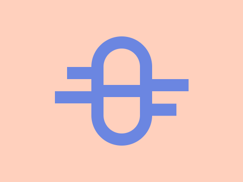
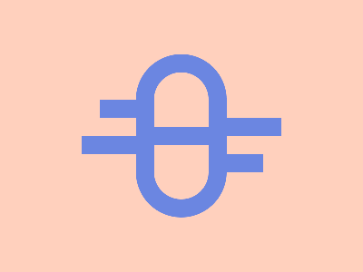

# Daily Target — Sep 11, 2026

Challenge: <https://cssbattle.dev/play/7vxnmvdZG5jOA5grQWZT>

## Result

<table>
	<tr>
		<th width="50%">User Submission</th>
		<th width="50%">Target</th>
	</tr>
	<tr>
		<td width="50%" align="center">
			
		</td>
		<td width="50%" align="center">
			
		</td>
	</tr>
</table>

## Code

```html
<p a b><p c><p a><style>*{background:#FFD0BD}[c]{width:60;height:140;border:5vw solid#6B86E1;margin:-180 142;border-radius:5pc}[a]{width:100;height:20;background:#6B86E1;color:#6B86E1;margin:80 142}[b]{margin:110 102;box-shadow:25vw 5vw,-5vw 5ch,5pc 64q
```
