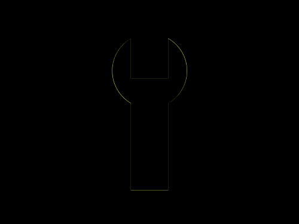

# Daily Target — Sep 12, 2026

Challenge: <https://cssbattle.dev/play/xINN7erbUm2K2I0zG5YF>

## Result

<table>
	<tr>
		<th width="50%">User Submission</th>
		<th width="50%">Target</th>
	</tr>
	<tr>
		<td width="50%" align="center">
			
		</td>
		<td width="50%" align="center">
			
		</td>
	</tr>
</table>

## Code

```html
<p a><p b><style>*{background:#1D025E}[a]{width:100;height:100;border-radius:50%;background:#F5E3B5;margin:45 142}[b]{width:50;height:120;margin:-205 167;box-shadow:0 50vh#F5E3B5
```
