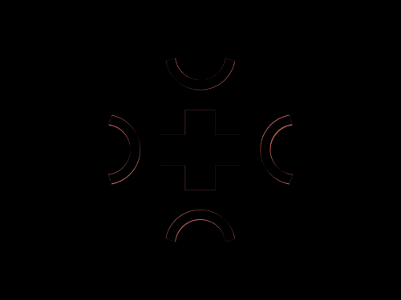

# Daily Target — Sep 14, 2026

Challenge: <https://cssbattle.dev/play/9sCBYHjLMHJ372p55cz7>

## Result

<table>
	<tr>
		<th width="50%">User Submission</th>
		<th width="50%">Target</th>
	</tr>
	<tr>
		<td width="50%" align="center">
			
		</td>
		<td width="50%" align="center">
			
		</td>
	</tr>
</table>

## Code

```html
<div><p a><p a b><p c><p c d><style>*{background:#F8B140}[b],[d]{rotate:90deg}div{width:190;height:190;border-radius:50%;margin:55 97;overflow:hidden}[a]{width:80;height:30;background:#465792;margin:80 55}[b]{margin:-110 55}[c]{width:50;height:50;border-radius:50%;border:11q solid#465792;margin:-145 60;-webkit-box-reflect:below 30vw}[d]{margin:170 155
```
