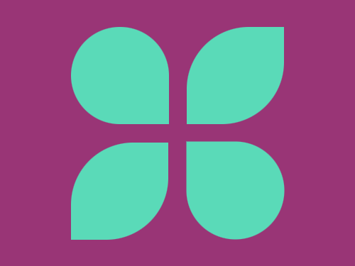

# Daily Target — Sep 15, 2026

Challenge: <https://cssbattle.dev/play/5ZezM7kuEUF3qoAOjCIx>

## Result

<table>
	<tr>
		<th width="50%">User Submission</th>
		<th width="50%">Target</th>
	</tr>
	<tr>
		<td width="50%" align="center">
			
		</td>
		<td width="50%" align="center">
			
		</td>
	</tr>
</table>

## Code

```html
<p><p a><p b><style>*{background:#993576}p{width:110;height:110;background:#5ADAB8;margin:30 72;border-radius:5pc 5pc 0 5pc}[a]{rotate:180deg;margin:-10 202}[b]{border-radius:74q 0;margin:-240 202;box-shadow:-138q 138q#5ADAB8
```
