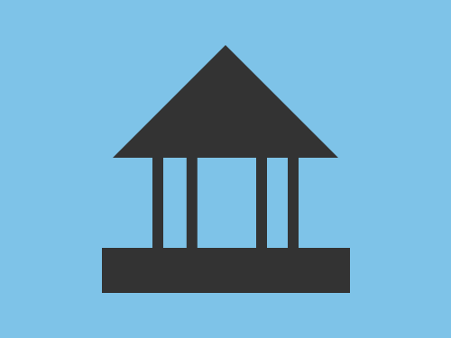

# Daily Target — Sep 17, 2026

Challenge: <https://cssbattle.dev/play/FI82QbLNuW9WtU2AemyW>

## Result

<table>
	<tr>
		<th width="50%">User Submission</th>
		<th width="50%">Target</th>
	</tr>
	<tr>
		<td width="50%" align="center">
			
		</td>
		<td width="50%" align="center">
			
		</td>
	</tr>
</table>

## Code

```html
<p a><p b><p b c><style>*{background:#7EC3E8}[a]{border-left:25vw solid#0000;border-right:25vw solid#0000;border-bottom:25vw solid#333;margin:40 92}[b]{background:#333;width:220;height:40;margin:80 82}[c]{color:#333;width:10;height:80;margin:-200 127;box-shadow:32q 0,5lh 0,30vw 0
```
