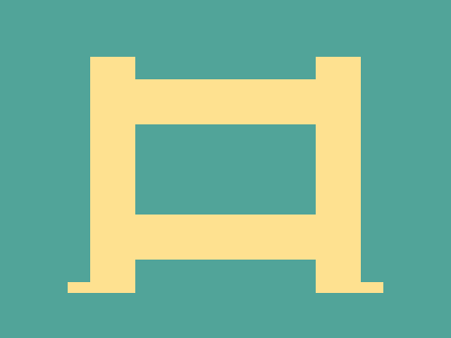
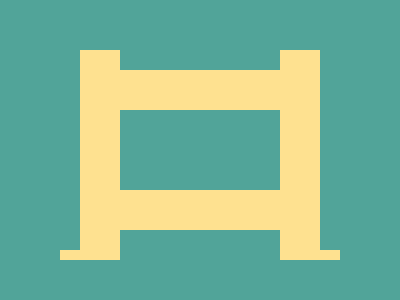

# Daily Target — Sep 20, 2026

Challenge: <https://cssbattle.dev/play/2R2qUfqneVtkaggWFkh5>

## Result

<table>
	<tr>
		<th width="50%">User Submission</th>
		<th width="50%">Target</th>
	</tr>
	<tr>
		<td width="50%" align="center">
			
		</td>
		<td width="50%" align="center">
			
		</td>
	</tr>
</table>

## Code

```html
<p a><p b><p b c><style>*{background:#51A499}[a]{width:160;height:80;border:5ch solid#FEE190;margin:70 72}[b]{width:40;height:210;background:#FEE190;margin:-250 72;box-shadow:50vw 0#FEE190}[c]{width:60;height:10;margin:240 52;box-shadow:55vw 0#FEE190
```
