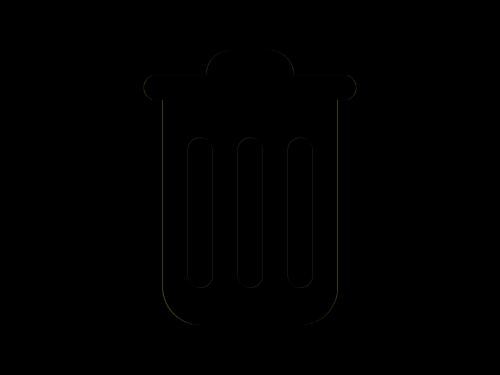

# Daily Target — Sep 25, 2026

Challenge: <https://cssbattle.dev/play/zeOBey0n5j5vQjLKIkau>

## Result

<table>
	<tr>
		<th width="50%">User Submission</th>
		<th width="50%">Target</th>
	</tr>
	<tr>
		<td width="50%" align="center">
			
		</td>
		<td width="50%" align="center">
			
		</td>
	</tr>
</table>

## Code

```html
<p><p a><p b><p b c><style>*{background:#FFF8E1}p{width:70;height:40;background:#9676CF;margin:40 157;border-radius:5vw}[a]{width:140;height:190;margin:-50 122;border-radius:0 0 32q 32q}[b]{width:170;height:20;background:#7454B4;color:#7454B4;margin:-200 107}[c]{width:20;height:120;margin:230 142;box-shadow:5ch 0,5pc 0
```
