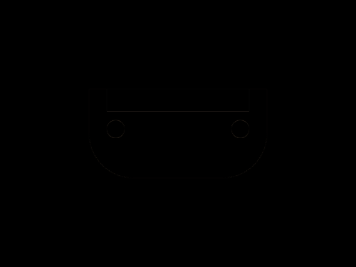

# Daily Target — Sep 26, 2026

Challenge: <https://cssbattle.dev/play/cRbtp0spzhZ0a6BHgeqN>

## Result

<table>
	<tr>
		<th width="50%">User Submission</th>
		<th width="50%">Target</th>
	</tr>
	<tr>
		<td width="50%" align="center">
			
		</td>
		<td width="50%" align="center">
			
		</td>
	</tr>
</table>

## Code

```html
<p a><p b><p c><style>*{background:#747992}[a]{width:200;height:100;background:#EED9D9;margin:100 92;border-radius:0 0 53q 53q}[b]{width:160;height:25;background:#394257;margin:-200 112}[c]{width:20;height:20;border-radius:50%;margin:210 112;box-shadow:35vw 0#747992
```
