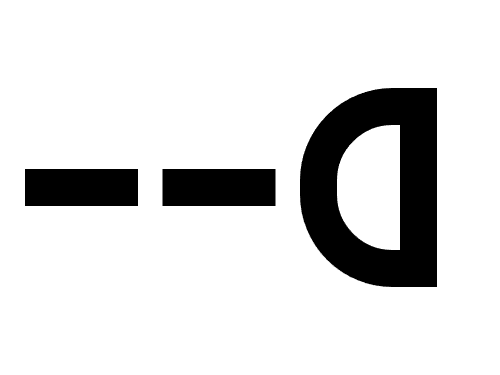
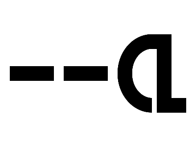

# Daily Target — Sep 28, 2026

Challenge: <https://cssbattle.dev/play/sPBh2rqUt3ilhlL5Rdhj>

## Result

<table>
	<tr>
		<th width="50%">User Submission</th>
		<th width="50%">Target</th>
	</tr>
	<tr>
		<td width="50%" align="center">
			
		</td>
		<td width="50%" align="center">
			
		</td>
	</tr>
</table>

## Code

```html
<p a><p b><p c>
<style>
  *{
    margin:0;
    position:fixed;
  }
  [a]{
    width:90;
    height:30;
    background:#000;
    margin:135 20;
    box-shadow:110px 0;
  }
  [b]{
    width:50;
    height:100;
    border:30px solid;
    border-radius:74px 0 0 74px;
    margin:70 240;
  }
</style>
```
