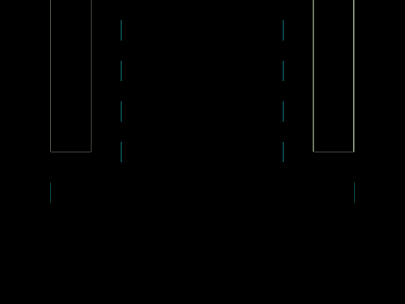

# Daily Target — Sep 29, 2026

Challenge: <https://cssbattle.dev/play/EABR37FZaeuj1tSIEZo3>

## Result

<table>
	<tr>
		<th width="50%">User Submission</th>
		<th width="50%">Target</th>
	</tr>
	<tr>
		<td width="50%" align="center">
			
		</td>
		<td width="50%" align="center">
			
		</td>
	</tr>
</table>

## Code

```html
<p a><p b><style>*{background:#C0D6E7}[a]{width:300;height:20;background:#CC5360;color:#CC5360;margin:20 42;box-shadow:0 5ch,0 5pc,0 30vw,0 40vw}[b]{width:40;height:150;background:#2D3464;border:32q solid#C0D6E7;margin:-90 12;-webkit-box-reflect:right 40vw
```
